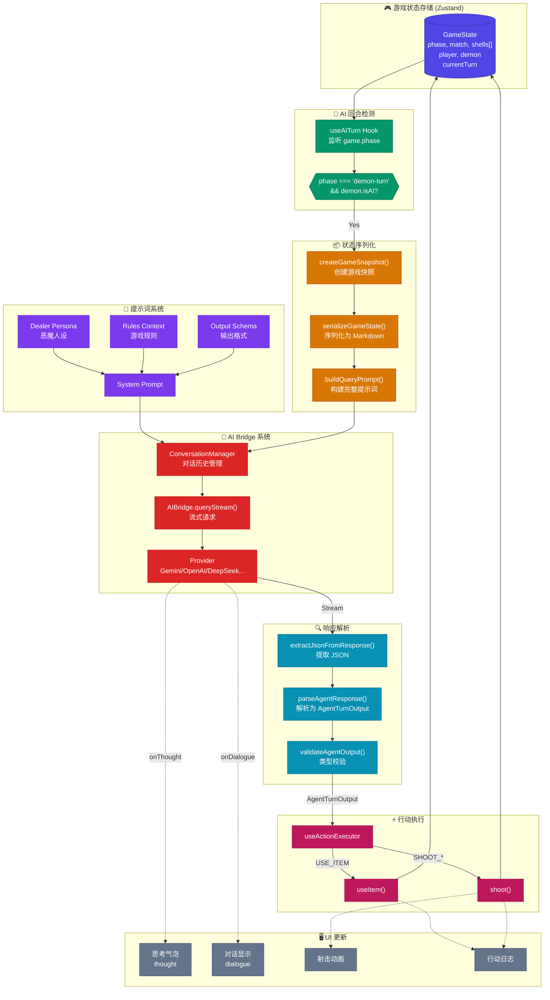
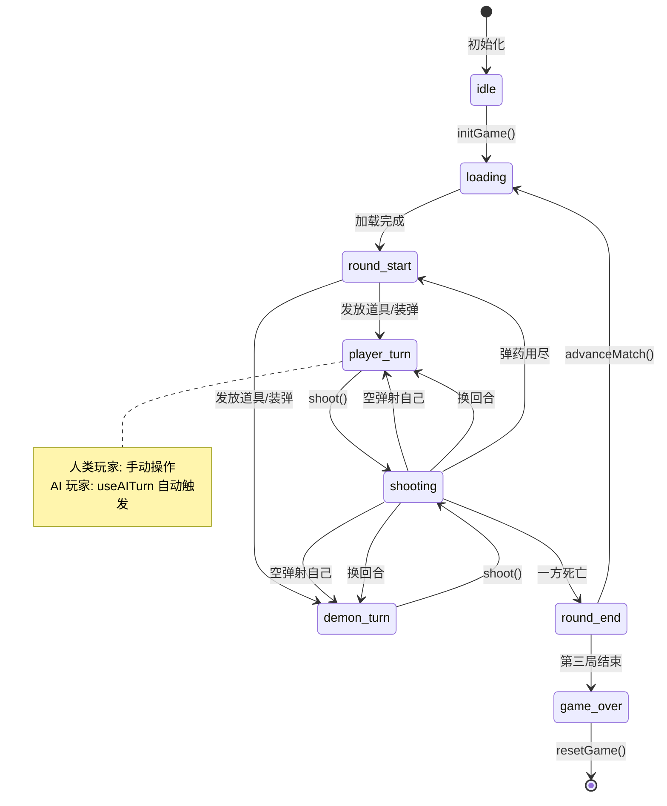
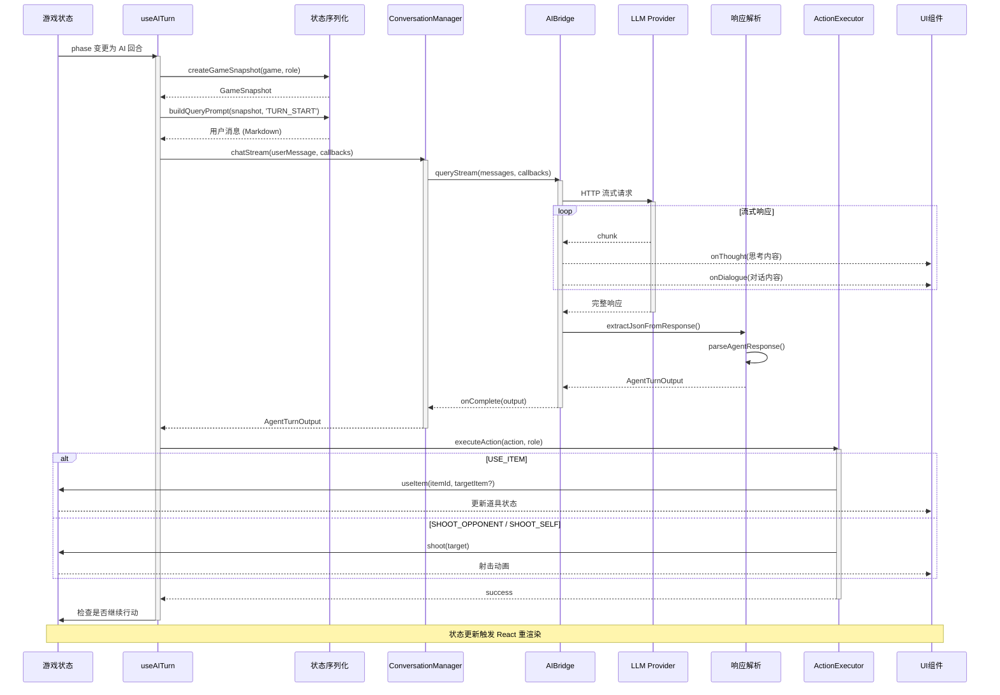
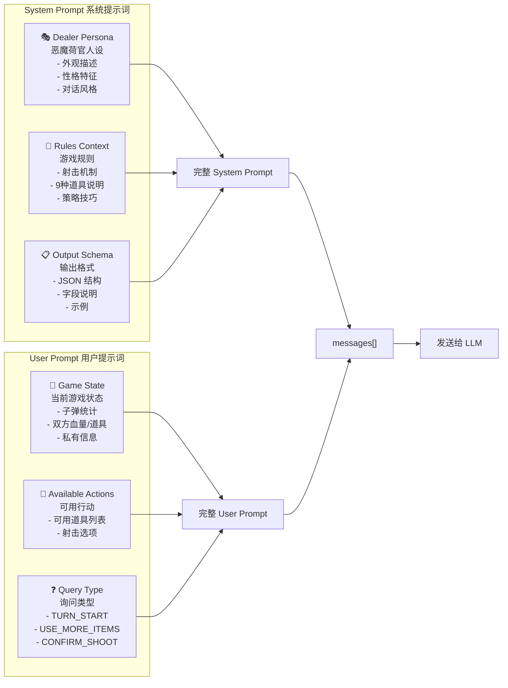
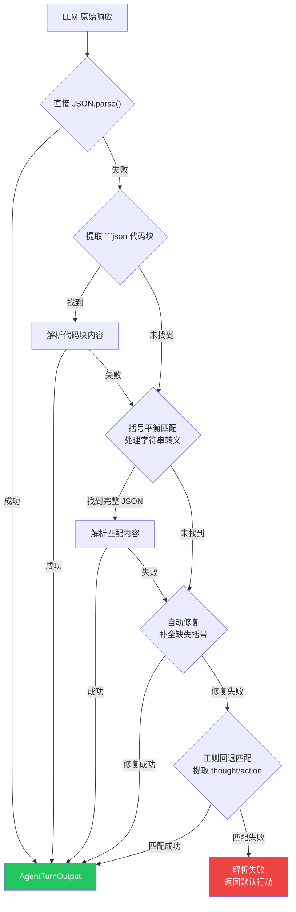
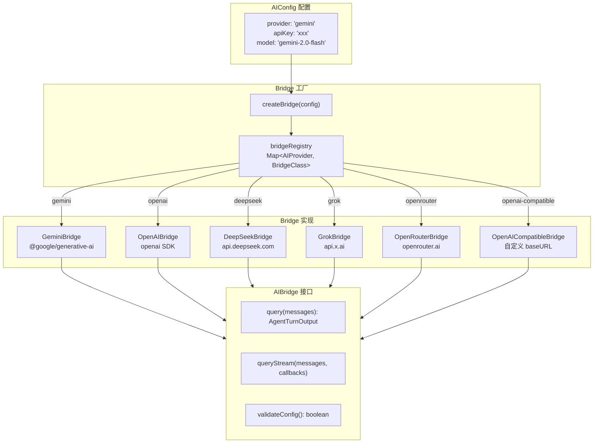
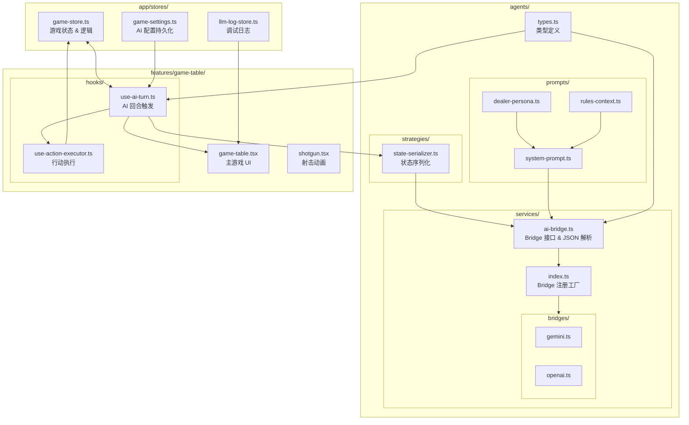

# 系统架构图

## 核心数据流

```mermaid
flowchart TB
    subgraph GameStore["🎮 游戏状态存储 (Zustand)"]
        GS[("GameState<br/>phase, match, shells[]<br/>player, demon<br/>currentTurn")]
    end

    subgraph AITurnHook["🎯 AI 回合检测"]
        ATH["useAITurn Hook<br/>监听 game.phase"]
        PHC{{"phase === 'demon-turn'<br/>&& demon.isAI?"}}
    end

    subgraph Serialization["📦 状态序列化"]
        CGS["createGameSnapshot()<br/>创建游戏快照"]
        SGS["serializeGameState()<br/>序列化为 Markdown"]
        BQP["buildQueryPrompt()<br/>构建完整提示词"]
    end

    subgraph PromptSystem["💬 提示词系统"]
        SP["System Prompt"]
        DP["Dealer Persona<br/>恶魔人设"]
        RC["Rules Context<br/>游戏规则"]
        OS["Output Schema<br/>输出格式"]
    end

    subgraph AIBridge["🤖 AI Bridge 系统"]
        CM["ConversationManager<br/>对话历史管理"]
        AB["AIBridge.queryStream()<br/>流式请求"]
        PROV["Provider<br/>Gemini/OpenAI/DeepSeek..."]
    end

    subgraph ResponseParse["🔍 响应解析"]
        EJ["extractJsonFromResponse()<br/>提取 JSON"]
        PAR["parseAgentResponse()<br/>解析为 AgentTurnOutput"]
        VAL["validateAgentOutput()<br/>类型校验"]
    end

    subgraph ActionExec["⚡ 行动执行"]
        AE["useActionExecutor"]
        UI["useItem()"]
        SH["shoot()"]
    end

    subgraph UIUpdate["🖥️ UI 更新"]
        TH["思考气泡<br/>thought"]
        DL["对话显示<br/>dialogue"]
        AN["射击动画"]
        LOG["行动日志"]
    end

    %% 主流程
    GS --> ATH
    ATH --> PHC
    PHC -->|Yes| CGS
    CGS --> SGS
    SGS --> BQP

    SP --> CM
    DP --> SP
    RC --> SP
    OS --> SP

    BQP --> CM
    CM --> AB
    AB --> PROV

    PROV -->|Stream| EJ
    EJ --> PAR
    PAR --> VAL

    VAL -->|AgentTurnOutput| AE
    AE -->|USE_ITEM| UI
    AE -->|SHOOT_*| SH

    UI --> GS
    SH --> GS

    %% UI 更新
    PROV -.->|onThought| TH
    PROV -.->|onDialogue| DL
    SH -.-> AN
    UI -.-> LOG
    SH -.-> LOG

    %% 样式
    classDef store fill:#4f46e5,color:#fff,stroke:#3730a3
    classDef hook fill:#059669,color:#fff,stroke:#047857
    classDef serial fill:#d97706,color:#fff,stroke:#b45309
    classDef prompt fill:#7c3aed,color:#fff,stroke:#6d28d9
    classDef bridge fill:#dc2626,color:#fff,stroke:#b91c1c
    classDef parse fill:#0891b2,color:#fff,stroke:#0e7490
    classDef exec fill:#be185d,color:#fff,stroke:#9d174d
    classDef ui fill:#64748b,color:#fff,stroke:#475569

    class GS store
    class ATH,PHC hook
    class CGS,SGS,BQP serial
    class SP,DP,RC,OS prompt
    class CM,AB,PROV bridge
    class EJ,PAR,VAL parse
    class AE,UI,SH exec
    class TH,DL,AN,LOG ui
```

## 状态机流转

```mermaid
stateDiagram-v2
    [*] --> idle: 初始化
    idle --> loading: initGame()
    loading --> round_start: 加载完成

    round_start --> player_turn: 发放道具/装弹
    round_start --> demon_turn: 发放道具/装弹

    player_turn --> shooting: shoot()
    demon_turn --> shooting: shoot()

    shooting --> player_turn: 空弹射自己
    shooting --> demon_turn: 空弹射自己
    shooting --> player_turn: 换回合
    shooting --> demon_turn: 换回合

    shooting --> round_start: 弹药用尽
    shooting --> round_end: 一方死亡

    round_end --> loading: advanceMatch()
    round_end --> game_over: 第三局结束

    game_over --> [*]: resetGame()

    note right of player_turn
        人类玩家: 手动操作
        AI 玩家: useAITurn 自动触发
    end note
```

## AI 决策流程

```mermaid
sequenceDiagram
    participant GS as 游戏状态
    participant Hook as useAITurn
    participant Ser as 状态序列化
    participant CM as ConversationManager
    participant Bridge as AIBridge
    participant LLM as LLM Provider
    participant Parse as 响应解析
    participant Exec as ActionExecutor
    participant UI as UI组件

    GS->>Hook: phase 变更为 AI 回合
    activate Hook

    Hook->>Ser: createGameSnapshot(game, role)
    Ser-->>Hook: GameSnapshot

    Hook->>Ser: buildQueryPrompt(snapshot, 'TURN_START')
    Ser-->>Hook: 用户消息 (Markdown)

    Hook->>CM: chatStream(userMessage, callbacks)
    activate CM

    CM->>Bridge: queryStream(messages, callbacks)
    activate Bridge

    Bridge->>LLM: HTTP 流式请求
    activate LLM

    loop 流式响应
        LLM-->>Bridge: chunk
        Bridge-->>UI: onThought(思考内容)
        Bridge-->>UI: onDialogue(对话内容)
    end

    LLM-->>Bridge: 完整响应
    deactivate LLM

    Bridge->>Parse: extractJsonFromResponse()
    Parse->>Parse: parseAgentResponse()
    Parse-->>Bridge: AgentTurnOutput

    Bridge-->>CM: onComplete(output)
    deactivate Bridge

    CM-->>Hook: AgentTurnOutput
    deactivate CM

    Hook->>Exec: executeAction(action, role)
    activate Exec

    alt USE_ITEM
        Exec->>GS: useItem(itemId, targetItem?)
        GS-->>UI: 更新道具状态
    else SHOOT_OPPONENT / SHOOT_SELF
        Exec->>GS: shoot(target)
        GS-->>UI: 射击动画
    end

    Exec-->>Hook: success
    deactivate Exec

    Hook->>GS: 检查是否继续行动
    deactivate Hook

    Note over GS,UI: 状态更新触发 React 重渲染
```

## 提示词构建结构

```mermaid
flowchart LR
    subgraph SystemPrompt["System Prompt 系统提示词"]
        direction TB
        P1["🎭 Dealer Persona<br/>恶魔荷官人设<br/>- 外观描述<br/>- 性格特征<br/>- 对话风格"]
        P2["📜 Rules Context<br/>游戏规则<br/>- 射击机制<br/>- 9种道具说明<br/>- 策略技巧"]
        P3["📋 Output Schema<br/>输出格式<br/>- JSON 结构<br/>- 字段说明<br/>- 示例"]
    end

    subgraph UserPrompt["User Prompt 用户提示词"]
        direction TB
        U1["🎲 Game State<br/>当前游戏状态<br/>- 子弹统计<br/>- 双方血量/道具<br/>- 私有信息"]
        U2["🎯 Available Actions<br/>可用行动<br/>- 可用道具列表<br/>- 射击选项"]
        U3["❓ Query Type<br/>询问类型<br/>- TURN_START<br/>- USE_MORE_ITEMS<br/>- CONFIRM_SHOOT"]
    end

    P1 --> SP[完整 System Prompt]
    P2 --> SP
    P3 --> SP

    U1 --> UP[完整 User Prompt]
    U2 --> UP
    U3 --> UP

    SP --> MSG["messages[]"]
    UP --> MSG

    MSG --> LLM["发送给 LLM"]
```

## JSON 解析容错机制

```mermaid
flowchart TB
    INPUT["LLM 原始响应"]

    INPUT --> S1{"直接 JSON.parse()"}
    S1 -->|成功| OUTPUT["AgentTurnOutput"]
    S1 -->|失败| S2

    S2{"提取 ```json 代码块"}
    S2 -->|找到| S2P["解析代码块内容"]
    S2P -->|成功| OUTPUT
    S2P -->|失败| S3
    S2 -->|未找到| S3

    S3{"括号平衡匹配<br/>处理字符串转义"}
    S3 -->|找到完整 JSON| S3P["解析匹配内容"]
    S3P -->|成功| OUTPUT
    S3P -->|失败| S4
    S3 -->|未找到| S4

    S4{"自动修复<br/>补全缺失括号"}
    S4 -->|修复成功| OUTPUT
    S4 -->|修复失败| S5

    S5{"正则回退匹配<br/>提取 thought/action"}
    S5 -->|匹配成功| OUTPUT
    S5 -->|匹配失败| ERROR["解析失败<br/>返回默认行动"]

    style OUTPUT fill:#22c55e,color:#fff
    style ERROR fill:#ef4444,color:#fff
```

## AI Bridge 工厂模式

```mermaid
flowchart TB
    subgraph Config["AIConfig 配置"]
        CFG["provider: 'gemini'<br/>apiKey: 'xxx'<br/>model: 'gemini-2.0-flash'"]
    end

    subgraph Factory["Bridge 工厂"]
        REG["bridgeRegistry<br/>Map&lt;AIProvider, BridgeClass&gt;"]
        CB["createBridge(config)"]
    end

    subgraph Bridges["Bridge 实现"]
        GB["GeminiBridge<br/>@google/generative-ai"]
        OB["OpenAIBridge<br/>openai SDK"]
        DB["DeepSeekBridge<br/>api.deepseek.com"]
        GRB["GrokBridge<br/>api.x.ai"]
        ORB["OpenRouterBridge<br/>openrouter.ai"]
        OCB["OpenAICompatibleBridge<br/>自定义 baseURL"]
    end

    subgraph Interface["AIBridge 接口"]
        QRY["query(messages): AgentTurnOutput"]
        STR["queryStream(messages, callbacks)"]
        VAL["validateConfig(): boolean"]
    end

    CFG --> CB
    CB --> REG
    REG -->|gemini| GB
    REG -->|openai| OB
    REG -->|deepseek| DB
    REG -->|grok| GRB
    REG -->|openrouter| ORB
    REG -->|openai-compatible| OCB

    GB --> Interface
    OB --> Interface
    DB --> Interface
    GRB --> Interface
    ORB --> Interface
    OCB --> Interface
```

## 文件结构映射

```mermaid
flowchart TB
    subgraph Stores["app/stores/"]
        GS["game-store.ts<br/>游戏状态 & 逻辑"]
        GST["game-settings.ts<br/>AI 配置持久化"]
        LLS["llm-log-store.ts<br/>调试日志"]
    end

    subgraph Agents["agents/"]
        subgraph Services["services/"]
            AB["ai-bridge.ts<br/>Bridge 接口 & JSON 解析"]
            IDX["index.ts<br/>Bridge 注册工厂"]
            subgraph BridgeImpl["bridges/"]
                GEM["gemini.ts"]
                OAI["openai.ts"]
            end
        end
        subgraph Prompts["prompts/"]
            SYS["system-prompt.ts"]
            DP["dealer-persona.ts"]
            RC["rules-context.ts"]
        end
        subgraph Strategies["strategies/"]
            SS["state-serializer.ts<br/>状态序列化"]
        end
        TYP["types.ts<br/>类型定义"]
    end

    subgraph Features["features/game-table/"]
        subgraph Hooks["hooks/"]
            UAT["use-ai-turn.ts<br/>AI 回合触发"]
            UAE["use-action-executor.ts<br/>行动执行"]
        end
        GT["game-table.tsx<br/>主游戏 UI"]
        SG["shotgun.tsx<br/>射击动画"]
    end

    GS <--> UAT
    GST --> UAT
    UAT --> SS
    SS --> AB
    AB --> IDX
    IDX --> BridgeImpl
    SYS --> AB
    DP --> SYS
    RC --> SYS
    TYP --> AB
    TYP --> UAT
    UAT --> UAE
    UAE --> GS
    UAT --> GT
    LLS --> GT
```
